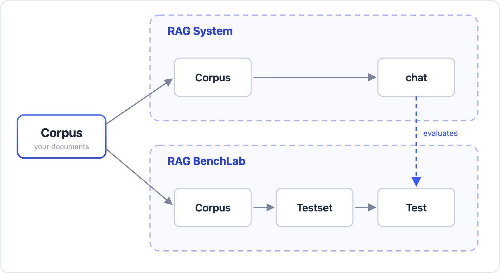

<p align="center"><a href="README.md">English</a> | <a href="README.zh.md">中文</a></p>

#  RAG-BenchLab

A fast, intelligent, out-of-the-box evaluation tool for RAG systems: **build a testset (question–answer pairs) from your own documents, then score your RAG system with industry-recognized metrics.**



## Features

**One tool for the whole loop**
Build the testset and evaluate the RAG system in one place — nothing has to be exported between tools.

**Easy to use, no code required**
Everything happens in the UI. No environment to set up, no scripts to write.

**High-quality testset generation**
Automatic review and filtering, so the testset is usable as generated and needs little manual correction.

**Fast, accurate RAG evaluation**
Five industry-recognized RAG metrics built in. Results are cached, so repeated runs while tuning your RAG system cost fewer tokens.

**Smart, broad RAG system support**
Connects to a wide range of RAG systems.

## Usage

Open <http://localhost:6742> in a browser and go through five steps:

**1. Configure models**
Add one LLM and one Embedding: fill in Base URL, API Key and Model, then click Save.

**2. Configure the RAG adapter** (skip this if you only need a testset)
Tell the tool how to call your RAG system. There are two ways:

- **Smart Fill** — give a platform name (e.g. `RAGFlow`) or the URL of that platform's API documentation; the adapter configuration is derived automatically and verified against the live system
- **Manual** — fill in the headers template, the body template, and the answer / contexts extraction paths yourself

**3. Create a corpus**
Upload your documents (a zip, a directory, or individual files).

**4. Generate the testset**
Pick the corpus and a model, set the generation parameters, and wait for the question–answer pairs. When it finishes you can review, edit and delete entries one by one, and export or import them.

**5. Evaluate the RAG system**
Pick the testset, the RAG adapter and the models, select the metrics, and run it. The report gives the RAG system's overall score and a score for every question.

## Metrics

The metrics are computed by [ragas](https://github.com/vibrantlabsai/ragas); the definitions below are taken from ragas 0.4.3.

**Context Precision** — [documentation](https://docs.ragas.io/en/stable/concepts/metrics/available_metrics/context_precision/)
Measures whether the **relevant items that were retrieved are ranked first** — it is the average precision of the ranking, not merely whether what came back is relevant.

**Context Recall** — [documentation](https://docs.ragas.io/en/stable/concepts/metrics/available_metrics/context_recall/)
Against the reference answer, measures whether **everything that should have been retrieved was retrieved** (estimated from hits and misses).

**Faithfulness** — [documentation](https://docs.ragas.io/en/stable/concepts/metrics/available_metrics/faithfulness/)
Splits the system's answer into individual statements and judges, one by one, whether each can be **directly inferred from the retrieved content**. Score = supported statements ÷ total statements. A low score means the answer contains fabrications, or goes beyond what was retrieved.

**Response Relevancy** — [documentation](https://docs.ragas.io/en/stable/concepts/metrics/available_metrics/answer_relevance/)
Measures how relevant the answer is to the question. **Not answering what was asked, missing information, and padding** all lose points. 0 to 1, where 1 is best.

**Answer Correctness** — [documentation](https://docs.ragas.io/en/stable/concepts/metrics/available_metrics/answer_correctness/)
Compares the system's answer with the reference answer: a combined score of **factual consistency** and **semantic similarity**, weighted 0.75 / 0.25 by default.

> **Context Precision, Context Recall and Faithfulness** need the RAG system to return the retrieved chunks. If the adapter has no Contexts Path configured, these three are greyed out and their averages are left blank in the report.

## Installation

### Docker (macOS / Windows / Linux)

```bash
IMAGE=sgyaqing/rag-benchlab:0.1.0
#IMAGE=registry.cn-hangzhou.aliyuncs.com/sgyaqing/rag-benchlab:0.1.0

docker run -d --name rag-benchlab \
  -p 6742:6742 \
  -v rbl-data:/app/data \
  -v rbl-logs:/app/logs \
  "$IMAGE"
```

Open <http://localhost:6742>. To stop it: `docker stop rag-benchlab`.

> **If your RAG system runs on the same machine**, add one more flag on Linux so that `localhost` inside the container reaches the host:
> `--add-host=host.docker.internal:host-gateway`
> (Docker Desktop on macOS and Windows already resolves that name; no flag needed.)

> ⚠️ **Version 0.1.0 has no authentication.** Anyone who can reach this service can see the API keys stored in it. Keep it on an internal network, or put it behind a proxy that authenticates — **do not expose it to the public internet.**

### macOS (recommended)

**Option 1: portable build**
Download `RAG-BenchLab-0.1.0-macos-arm64.zip` from [Releases](https://github.com/sgyaqing/RAG-BenchLab/releases) and double-click `start.command` after extracting it. Python and every dependency are included; nothing needs to be installed first.

> **The recommended way to run it is the portable build on macOS**: the NumPy inside it calls Apple's macOS-optimised math libraries directly, which makes the vector work much faster — an optimisation that is unavailable inside Docker or on Windows. **The speed-up for testset generation and evaluation is substantial.**

**Option 2: Docker**
See the Docker section above.

### Windows

**Option 1: portable build**
Download `RAG-BenchLab-0.1.0-windows-x64.zip` from [Releases](https://github.com/sgyaqing/RAG-BenchLab/releases) and double-click `start.bat` after extracting it. Python and every dependency are included; nothing needs to be installed first.

**Option 2: Docker**
See the Docker section above.

### Linux

See the Docker section above.

---

## License

Apache License 2.0, copyright Dalian Qinteng Technology Co., Ltd. See [LICENSE](LICENSE).

This product includes material derived from [ragas](https://github.com/vibrantlabsai/ragas). See [NOTICE](NOTICE).
